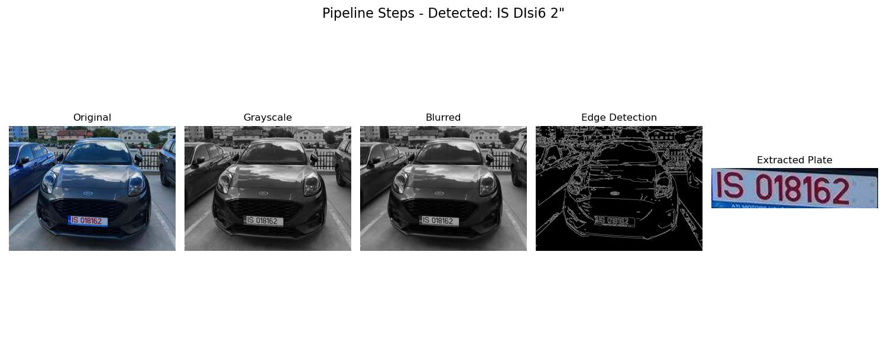
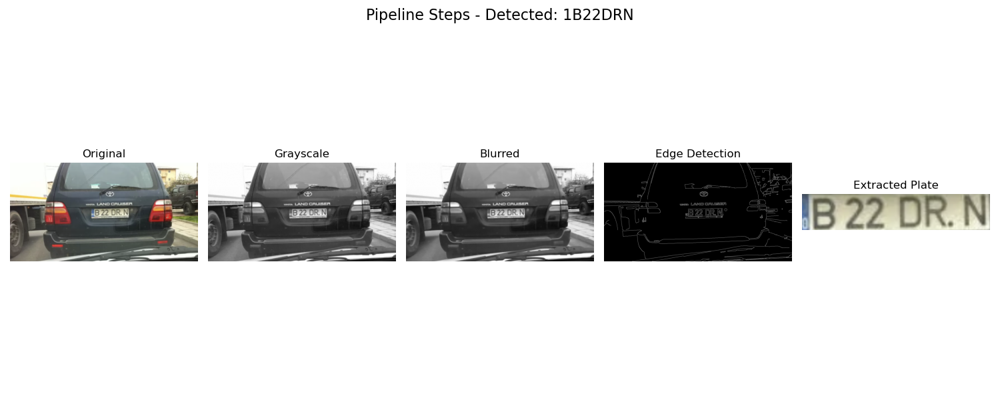
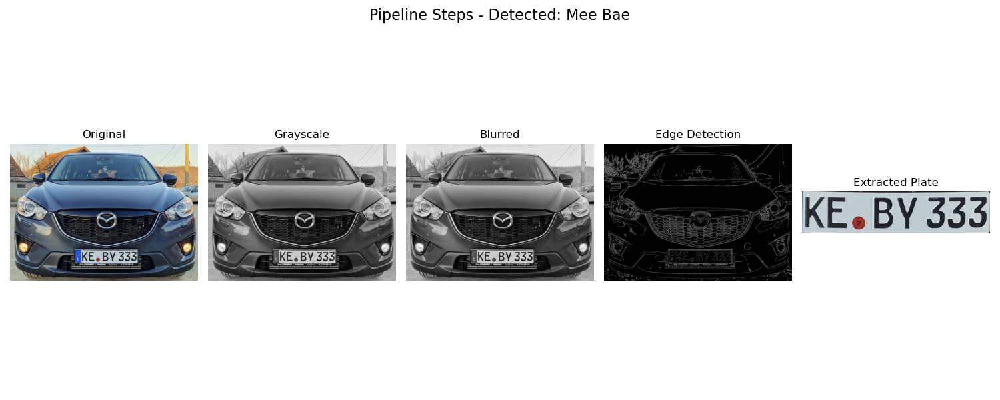

# Team 1 - Magna Lab

test
This repository contains all of our contributions to the project for the Magna Lab course.

---

## DOCUMENTATION
### **[PlateInfo.md](PlateInfo.md)**
Contains detailed documentation about Romanian license plate formats and validation rules:
- Explains the structure and format specifications for different plate types
- Documents the logic behind the validation process
- Provides examples and edge cases for testing
- Serves as a reference guide for understanding the plate validation implementation

## CLASSES OVERVIEW

### **1. [src/validator.py](src/validator.py)**
Contains the **RomanianLicensePlateValidator** class.
- Validates the format of Romanian license plates based on county codes, numeric part, and letter sequences.
- Supports standard plates for all Romanian counties.
- Handles special plates (military, government) and diplomatic plates.
- Implements comprehensive validation rules:
  - County code validation (all 41 counties + Bucharest)
  - Special prefix validation (A, FA, ALA, MAI)
  - Diplomatic prefix validation (CD, TC, CO)
  - Three-letter sequence validation (rules for I, O, Q, etc.)
  - Number sequence validation for different plate types


### **2. [src/recognizer.py](src/recognizer.py)**
Contains the **NumberPlateRecognizer** class.
- Processes images to identify and extract license plates.
- Implements a complete pipeline: image preprocessing, contour detection, plate extraction, and OCR.
- Provides visualization of all processing steps for debugging.
- Uses pytesseract for Optical Character Recognition of the plate text.

### **3. [src/utils.py](src/utils.py)**
Contains utility functions used across the project.
- `validImageFile`: Validates file extensions for image processing (.jpg, .jpeg, .png).
- Provides common helper functions to support other modules.

### **4. [src/camera.py](src/camera.py)**
Contains the **PiCamera2Stream** class.
- Provides a unified camera interface for different platforms (Raspberry Pi, macOS).
- Handles camera initialization with configurable resolution.
- Manages the video stream and resource cleanup.
- Supports Raspberry Pi Camera Module (using Picamera2) and webcams (using OpenCV).

### **5. [main.py](main.py)**
The central **orchestrator**.
- **Should** capture frames from the camera.
- **Should** recognize potential license plates.
- **Should** validate plate formats.
- **Should** store valid plates and metadata to the server (Firebase).
- **Should** be designed for continuous operation (real-time processing).

---

## GETTNG STARTED

### **1. Clone the Repository**

```bash
git clone https://github.com/VladTomici14/Team1-Magna-Lab/
cd Team1-Magna-Lab
```

### **2. Dependencies**
- OpenCV (`cv2`) - for image processing and camera interface
- pytesseract - for OCR (Optical Character Recognition)
- numpy - for numerical operations
- imutils - for contour detection
- matplotlib - for visualization
- picamera2 (if running on Raspberry Pi with Bookworm OS)

### **3. Platform Support**
The camera module supports:
- Raspberry Pi (using Picamera2, requires Bookworm OS)
- macOS (using OpenCV webcam interface)
- Support for additional platforms can be implemented as needed

## RESULTS




